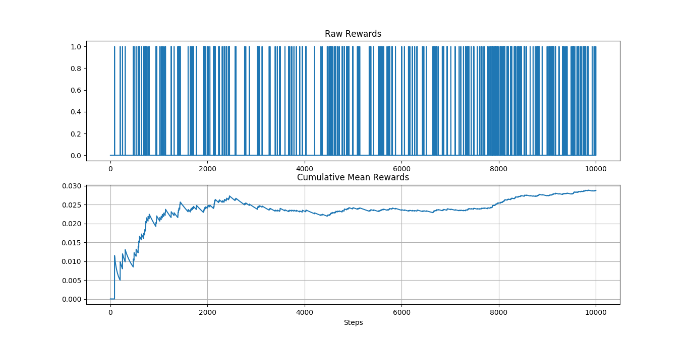

# Multi-Armed and Contextual Bandits

Implementation of common Multi-Armed and contextual bandits algorithms.

## Algorithms

### Standard Multi-Armed Bandits

- [x] Greedy with Optimistic Initialization
- [x] Epsilon-Greedy
- [x] Upper-Confidence Bound (UBC)
- [x] Gradient Bandit

### Contextual Multi-Armed Bandits

- [x] Epsilon-Greedy [1]
- [ ] Explore-First
- [ ] Bagging Explorer
- [ ] Online Cover

## Solutions to "Reinforcement Learning: An Introduction" [2]

### Sample-Average methods with Nonstationary Problems

Exercise 2.5 (programming) Design and conduct an experiment to demonstrate the
difficulties that sample-average methods have for nonstationary problems. Use a modified
version of the 10-armed testbed in which all the q(a) start out equal and then take
independent random walks (say by adding a normally distributed increment with mean
zero and standard deviation 0.01 to all the q(a) on each step). Prepare plots like
Figure 2.2 for an action-value method using sample averages, incrementally computed,
and another action-value method using a constant step-size parameter, alpha = 0.1. Use
epsilon = 0.1 and longer runs, say of 10,000 steps.

## Contextual Epsilon-Greedy

It uses one classifier (Logistic Regression) for each arm. The results of the
graph below were obtained using the [Bibtex multi-label dataset](http://manikvarma.org/downloads/XC/XMLRepository.html). Contextual Multi-Armed bandits don't have established
benchmarks yet, so most of its experiments are done with multi-label datasets, 
in which each feature is represented as an arm. One advantage of this is
that in each step we know the correct labels for all arms (even arms that the
algorithm didn't pull), one disadvantage though is that the arms are 
deterministic regarding the observation.

## References

[1] Cortes, David. “Adapting Multi-Armed Bandits Policies to Contextual Bandits Scenarios.”
ArXiv:1811.04383 [Cs, Stat], Nov. 2019. arXiv.org, <http://arxiv.org/abs/1811.04383>.  
[2] [Richard S. Sutton and Andrew G. Barto. 2018. Reinforcement Learning: An Introduction](http://incompleteideas.net/book/the-book.html)

