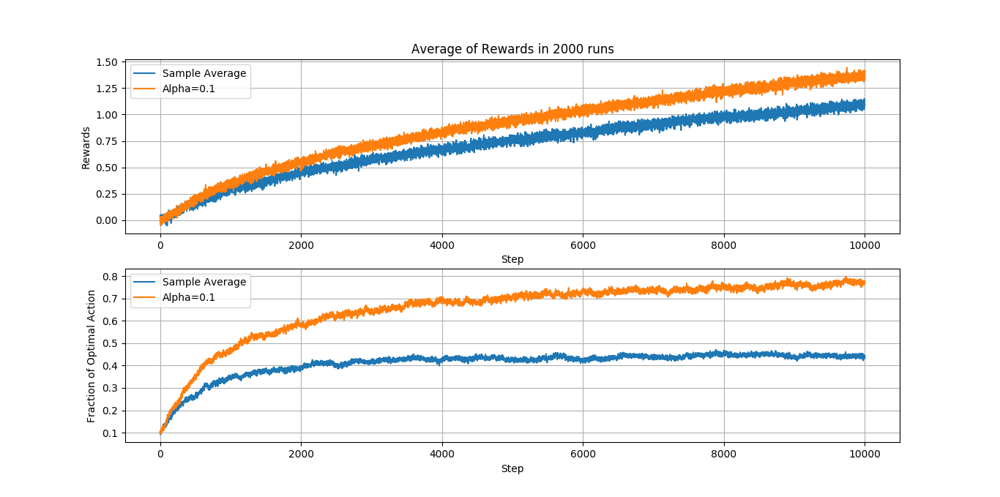

# Multi-Armed Bandits

Implementation of common Multi-Armed bandits algorithms and 
solution to bandit programming exercises of [Richard S. Sutton and Andrew G. Barto. 2018.
Reinforcement Learning: An Introduction](http://incompleteideas.net/book/the-book.html)

## Algorithms

- [x] Greedy with Optimistic Initialization
- [x] Epsilon-Greedy
- [x] Upper-Confidence Bound (UBC)
- [x] Gradient Bandit

### Sample-Average methods with Nonstationary Problems

Exercise 2.5 (programming) Design and conduct an experiment to demonstrate the
difficulties that sample-average methods have for nonstationary problems. Use a modified
version of the 10-armed testbed in which all the q(a) start out equal and then take
independent random walks (say by adding a normally distributed increment with mean
zero and standard deviation 0.01 to all the q(a) on each step). Prepare plots like
Figure 2.2 for an action-value method using sample averages, incrementally computed,
and another action-value method using a constant step-size parameter, alpha = 0.1. Use
epsilon = 0.1 and longer runs, say of 10,000 steps.

